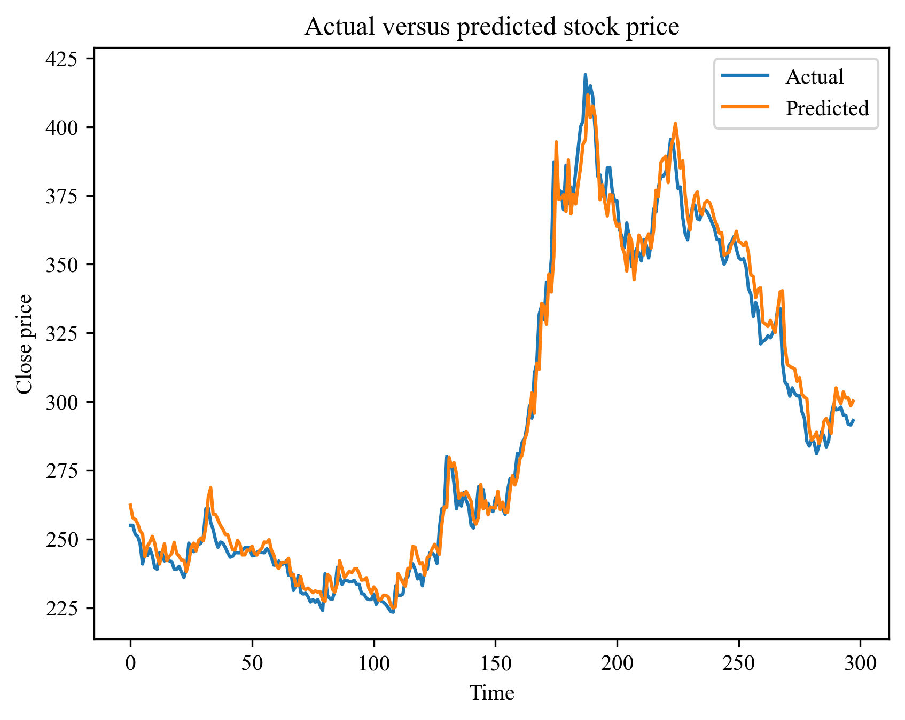

## Stock forecasting using LSTM-GCN network

### Project Description
- We performed NEPSE stock forecasting using graph-based method. Stock network is created using Pearson Correlation Coefficient. 
- The network takes 14 features as input, and spit out 1 feature as output (Close price) for next day.
- If corr >= threshold (0.3) then we create edge (i.e., edge value = 1) else 0.
- The obtained graph structure is further filtered using Minimum Spanning Tree (MST) algorithm, which helps to remove redundant edges and helps to make graph simpler.
- The final working graph is unweighted and undirected.

### Experimental Result
- Pearson Correlation Based Graph
The following is stock network obtained from Pearson Correlation Coefficient based graph construction technique. `(corr >= threshold (0.3)`
 

- MST filtered graph
After graph filteration technique (MST) we got following graph

- We got `MAE=11.21, MSE=419.34, MAPE=1.89`

- Case study of ticker; ADBL, we take a ticker ADBL and see its actual versus predicted close prices. The graph is as follows:

